# Preparation

Below are instructions for setting up the database and importing the data we will use into the database. You are not required to do this before the session. A remote login will be provided for a university of Warwick server. These instructions are for those who wish to run through the material on their local machine. The instructions are also just in case anything goes wrong and we need to run the class locally. 

By the end you will have a database called qstep which contains the table world_borders - including information about the borders of countries - and world_indicators - detailing a few world indicator values. If you have these then you are ready to work through the session materials found elsewhere in this repository.

## Data

Databases store data and allow us to access this data in an effcient manner. Our data of choice is the world borders from the thematic mapping website and World Development Indicators for countries collected by The World Bank. You will need to download all the data as directed below.

Both of the datasets are included in the data_sets folder in this repository. The data is licensed under creative commons, please see the Readme.txt file in the datasets/TM_WORLD_BORDER-0.30 folder and metadata.csv file in datasets/world_development_indicators for more information. My thanks for those who provided the data for adhering to open data access and distribution.

### World borders

The World Borders data contains polygons for each country. You can find the dataset and information from [here](http://thematicmapping.org/downloads/world_borders.php). The data is in a [shapefile](https://en.wikipedia.org/wiki/Shapefile) format which contains the polygons for each country (the border co-ordinates), other geospatial information such as the projection and also data about each country.

*NOTE*: Country borders are of course a matter of continual dispute and this dataset is used for convenience purposes only.

The thematic mapping website details the fields of the data as below:

| Column    | Type             | Description                                            |
|-----------|------------------|--------------------------------------------------------|
| Shape     | Polygon          | Country/area border as polygon(s)                      |
| FIPS      | String(2)        | FIPS 10-4 Country Code                                 |
| ISO2      | String(2)        | ISO 3166-1 Alpha-2 Country Code                        |
| ISO3      | String(3)        | ISO 3166-1 Alpha-3 Country Code                        |
| UN        | Short Integer(3) | ISO 3166-1 Numeric-3 Country Code                      |
| NAME      | String(50)       | Name of country/area                                   |
| AREA      | Long Integer(7)  | Land area, FAO Statistics (2002)                       |
| POP2005   | Double(10,0)     | Population, World Population Prospects (2005)          |
| REGION    | Short Integer(3) | Macro geographical (continental region), UN Statistics |
| SUBREGION | Short Integer(3) | Geographical sub-region, UN Statistics                 |
| LON       | Float(7,3)       | Longitude                                              |
| LAT       | Float(7,3)       | Latitude                                               |

Notice that the data types are either polygon (spatial shape), string (normal text). short integer (e.g., 22), Long Integer (e.g., 43425), double (e.g., 4.32) or float (-33.73).

We can visualisation shape file (and other geospatial data) using a program called [QGIS](https://www.qgis.org/en/site/index.html). We will not focus on QGIS on the session but it is worth being aware of and it can produce [choropleths](https://en.wikipedia.org/wiki/Choropleth_map) with our data like the one shown below, where colour corresponds to 2005 population.

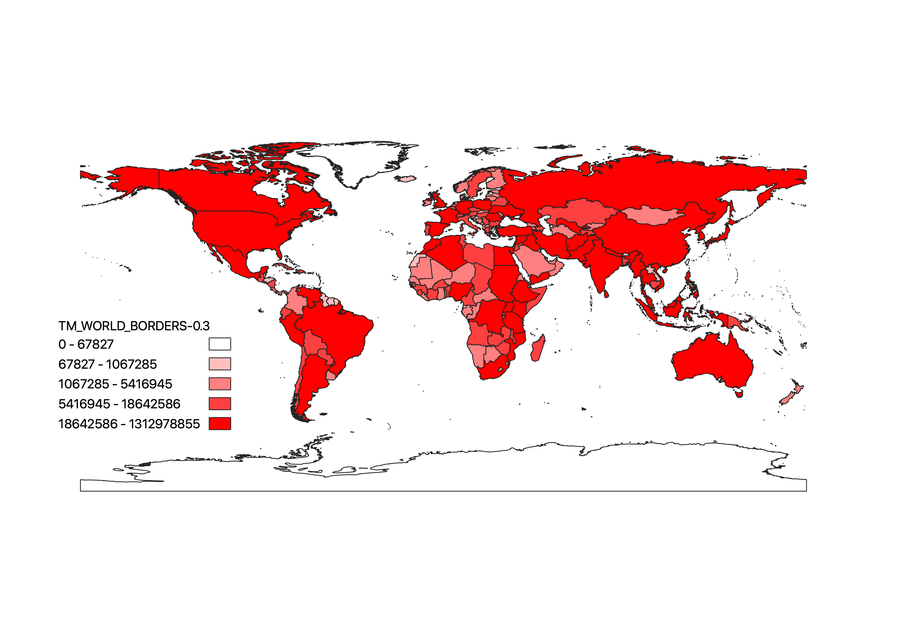

There is a copy of this data in the folder called Data_sets.

### World Development Indicators

The World Bank has collected information on Development Indicators for many countries accross the world. The data is freely available from [their query tool](https://databank.worldbank.org/reports.aspx?source=world-development-indicators). For our purposes we have downloaded the data from 2005 for all countries for the following variables:

1. Access to electricity (% of population)
2. Forest area (% of land area)
3. Gross domestic savings (% of GDP)
4. Labor force, total
5. Land area (sq. km)

and ran the following R code (contained in reformat_data.R) to restructure the data ready for importing into a database.

```r
install.packages('tidyverse')

require(tidyverse)

wdi_data <-
    read_csv('1_Preparation/datasets/world_development_indicators/data.csv') %>%
    select(
        -`Series Code`,
        country = `Country Name`,
        countryCode = `Country Code`,
        Series = `Series Name`,
        Value = `2005 [YR2005]`
    ) %>%
    pivot_wider(names_from = Series, values_from = Value) %>%
    select(
        country,
        countryCode,
        electricity = `Access to electricity (% of population)`,
        forest_area = `Forest area (% of land area)`,
        gross_domestic_savings = `Gross domestic savings (% of GDP)`,
        labor = `Labor force, total`,
        area = `Land area (sq. km)`
    ) %>%
    mutate_if(is.character, list( ~ na_if(., ".."))) %>%
    write_csv('1_Preparation/datasets/world_development_indicators/wide_data.csv')
```

The code turns our long format data

| Country Name | Country Code | Series Name                             | Series Code    | 2005 [YR205] |
|--------------|--------------|-----------------------------------------|----------------|--------------|
| Afghanistan  | AFG          | Access to electricity (% of population) | EG.ELC.ACCS.ZS | 23           |
| Afghanistan  | AFG          | Forest area (% of land area)            | AG.LND.FRST.ZS | 2.067824648  |
| Afghanistan  | AFG          | Gross domestic savings (% of GDP)       | NY.GDS.TOTL.ZS | -33.76417609 |
| Afghanistan  | AFG          | "Labor force, total"                    | SL.TLF.TOTL.IN | 8607338      |
| Afghanistan  | AFG          | Land area (sq. km)                      | AG.LND.TOTL.K2 | 652860       |
| ...          | ...          | ...                                     | ...            | ...          |

into easily importable wide format data with simpler column names. Each country is a single row in the table.

 country     | countryCode | electricity | forest_area | gross_domestic_savings | labor   | area   |
|-------------|:-----------:|-------------|-------------|------------------------|---------|--------|
| Afghanistan |     AFG     | 23          | 2.067824648 | -33.76417609           | 8607338 | 652860 |
| ...         |     ...     | ...         | ...         | ...                    | ...     | ...    |

This approach of using wide tables is consistent with the [tidydata](https://tidyr.tidyverse.org/articles/tidy-data.html) approach used in the R community and elsewhere in the data science community. The wide data file is called wide_data.csv and is in the world_development_indicators folder.

## Database installation

The PostgreSQL database program has excellent support for spatial geometries using the PostGIS extension. Our world data contains spatial polygons so PostgreSQL is an excellent choice. **Note** Other databases are available (see relational databases [here](https://db-engines.com/en/ranking)). 

The install instructions differ depending on your operating system.

### MacOS

[Postgres.app](https://postgresapp.com/) contains the PostgreSQL program, PostGIS and a nice interface for starting, stopping and accessing the database.

1. Download the Postgres.app program from [here](https://postgresapp.com/downloads.html)

2. Open the .dmg file and drag Postgres to the Applications folder

3. Go to the Applications folder and double click on Postgres

4. The Postgres interface will appear. Click on 'Initialize'

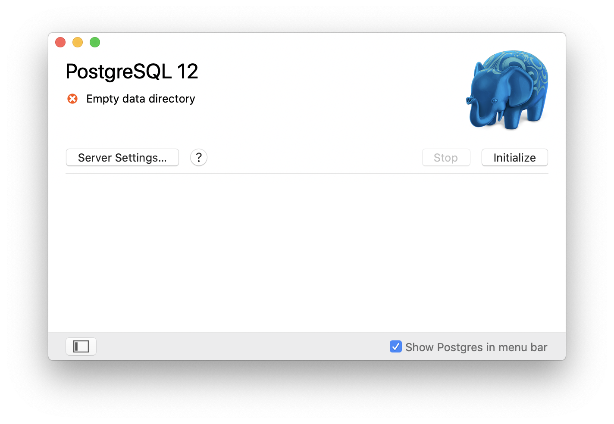

5. Three databases will be created. If you double click on a database then a terminal will open with a database prompt. 

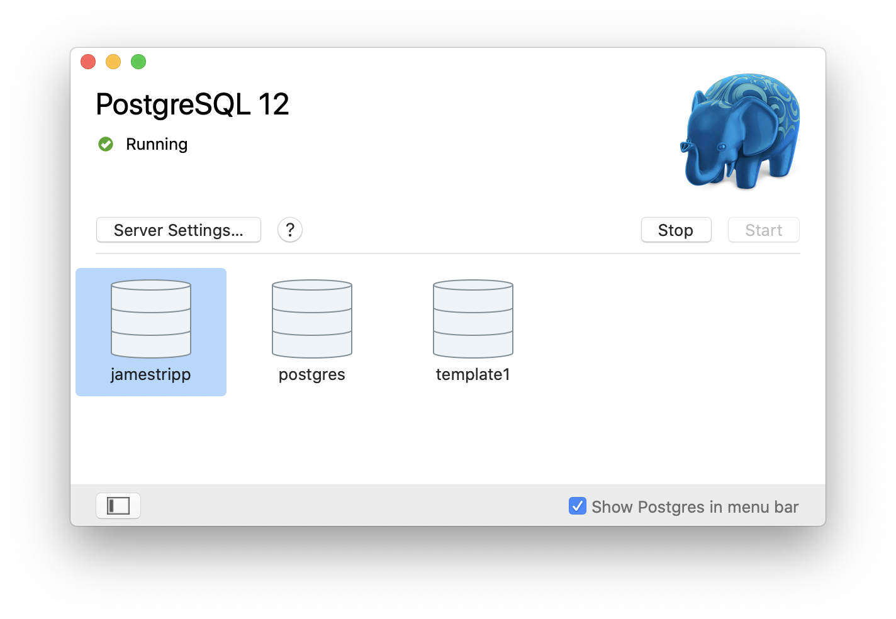

6. If you are running MacOS then you may have to enter a terminal command like '/Applications/Postgres.app/Contents/Versions/12/bin/psql -p5432 "postgres"'. This command runs Postgres.app and logs into the postgres database. To do so, go into Applications -> Utilities -> Terminal and copy and paste the command.

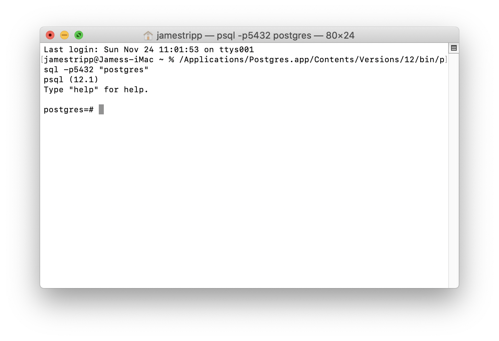

### Windows 10

The [EnterpriseDB](https://www.postgresql.org/download/windows/) installer allows you to both download and install PostgreSQL and PostGIS. Download the 12.1 installer by going [here](https://www.enterprisedb.com/downloads/postgres-postgresql-downloads) clicking under Windows x86-64.

Double clicking on the downloaded .exe file will start the installer. 

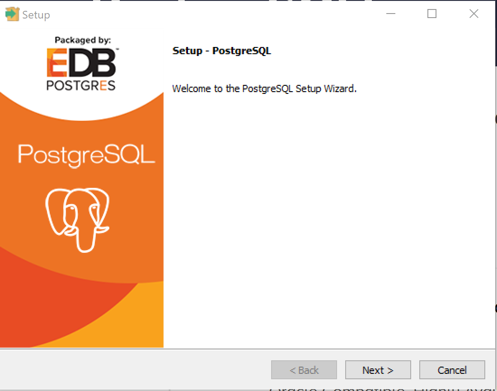

Select all the defaults and a password for the superuser (postgres). Remember the password as it will be difficult to reset. Ensure the port number is 5432.

When prompted choose to install Stack Builder. The Stack Builder program will install PostGIS for us.
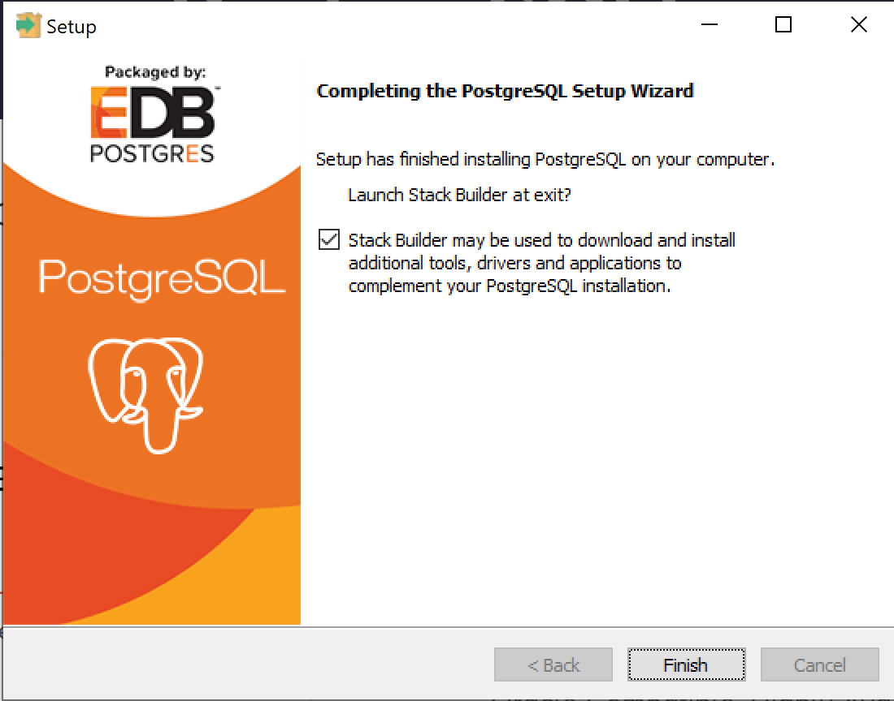

In the stack builder install page select the PostgreSQL program you've just installed.
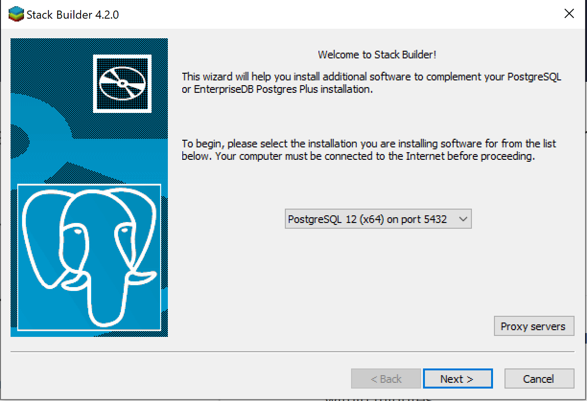

Choose PostGIS 3.0 Bundle within the Spatial Extensions on the next page and click Next.
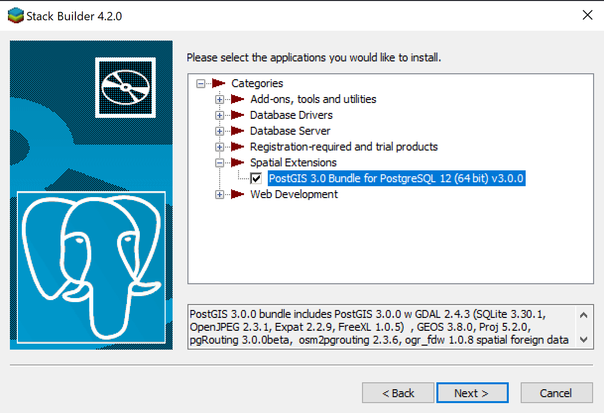

After the installer downloads PostGIS then hte PostGIS bundle installer will be shown. 
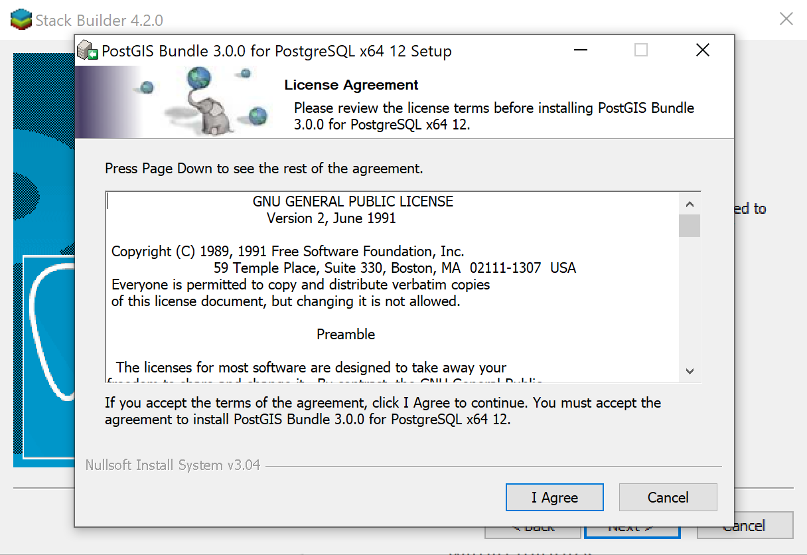

Choose agree and then install PostGIS. Choose yes when prompted about the GDAL_DATA environment. 
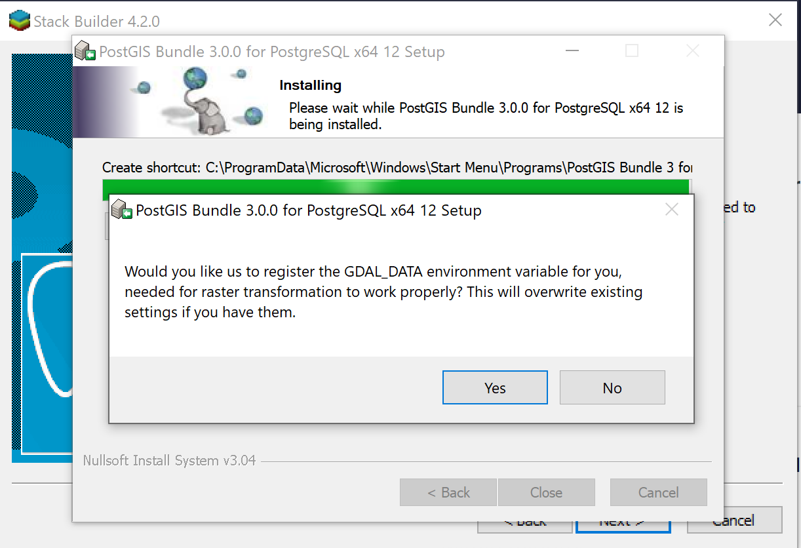

Choose yes for all the subsequent options and click close once the installer has completed.

To access the database you need to use a program called pgAdmin. Click on the start menu and select pgAdmin. The pgAdmin interface will start up in your default browser. You can connect to the server by clicking on PostgreSQL 12 under servers. You'll need to type in the password for the superuser(postgres).

You can issue commands to PostgreSQL by clicking on a database name and then going to Tools > Query Tool.
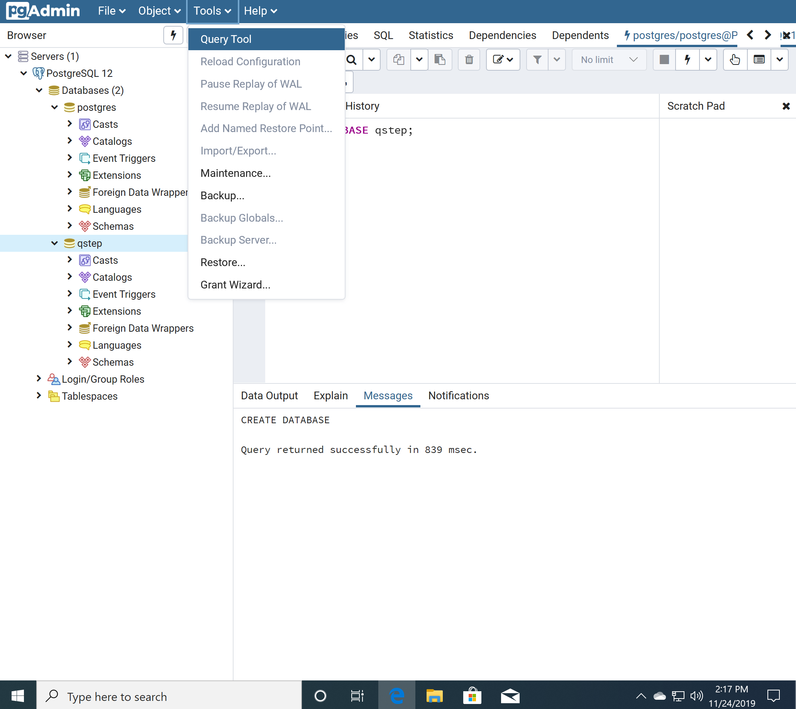

*Note* In the above screenshot the qstep database has already been created. Initially, only the postgres database will be there.

In the Query Tool, one type in a query (command) to the database and then selects to run the query by clicking on Execute.
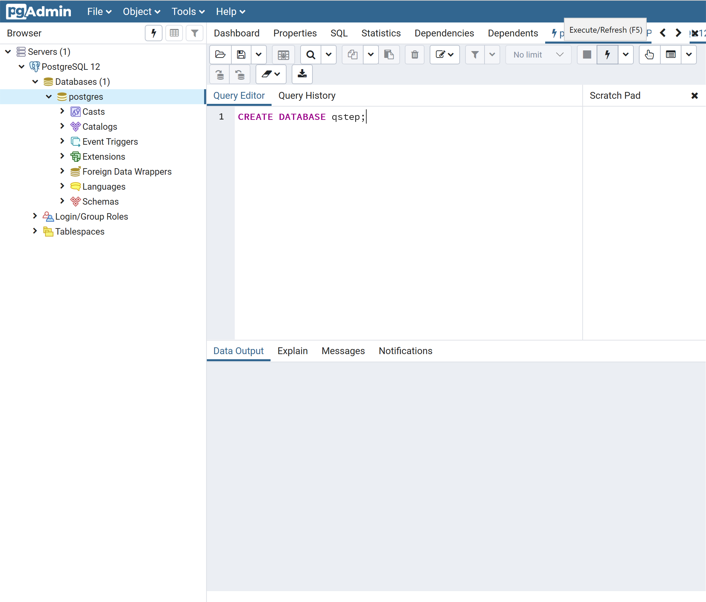

 Windows users should use Query Tool where I refer to the terminal in the session and commands starting withe a \ will not work - these are commands to the terminal tool called psql, see [the PostgreSQL documentation on psql](https://www.postgresql.org/docs/9.2/app-psql.html).

## Data upload

Let's get our data into our new database program. You will need to be at the PostgreSQL command prompt to continue.

### Making space

#### Database
Create a new database called qsteq by typing the following into the command prompt:

```sql
CREATE DATABASE qstep;
```

PostgreSQL will return the text 'CREATE DATABASE' to let you know the command has run without problem. To double check the database exists we run

```sql
\l
```

which will print all our databases and include the new qstep database. Your will look a little different depending on platform and the name of your admin user.

```sql
                                   List of databases
    Name    |   Owner    | Encoding |   Collate   |    Ctype    |   Access privileges   
------------+------------+----------+-------------+-------------+-----------------------
 jamestripp | jamestripp | UTF8     | en_US.UTF-8 | en_US.UTF-8 | 
 postgres   | postgres   | UTF8     | en_US.UTF-8 | en_US.UTF-8 | 
 qstep      | jamestripp | UTF8     | en_US.UTF-8 | en_US.UTF-8 | 
 template0  | postgres   | UTF8     | en_US.UTF-8 | en_US.UTF-8 | =c/postgres          +
            |            |          |             |             | postgres=CTc/postgres
 template1  | postgres   | UTF8     | en_US.UTF-8 | en_US.UTF-8 | =c/postgres          +
            |            |          |             |             | postgres=CTc/postgres
```

Press q to exist that view and return to the command prompt.

Switch to the new database

```sql
\c qstep
```

and the command prompt will now show qstep.

```sql
postgres=# \c qstep
You are now connected to database "qstep" as user "jamestripp".
qstep=# 
```

Enable the PostGIS extension - allowing us to use geospatial features from PostGIS.

```sql
CREATE EXTENSION postgis;
```

and you will see CREATE EXTENSION printed out.

#### Tables

Our two data sets will be in dedicated tables. When creating a table we need to let PostgreSQL know what type of data we will have. If you are interested, PostgreSQL has information about the data types used (such as numeric types, see [here](https://www.postgresql.org/docs/9.1/datatype-numeric.html)).

Our world borders table will be created by the PostGIS tools (see below). For the moment you do not need to create the world borders table.

You should create the World Indicators table.

```sql
CREATE TABLE world_indicators(
    country varchar(100),
    countryCode varchar(3),
    electricity double precision,
    forest_area double precision,
    gross_domestic_savings double precision,
    labor double precision,
    area double precision
);
```

Our tables are now ready for our data.

## World Indicators

Copying data from a csv file is surprisingly simple.

On MacOS and Linux you can run from

```sql
COPY world_indicators(
    country,
    countryCode,
    electricity,
    forest_area,
    gross_domestic_savings,
    labor,
    area
) 
FROM '/Users/jamestripp/wide_data.csv'
with NULL as 'NA' 
DELIMITER ',' CSV HEADER;
```

The above command copies over our CSV data file into the PostgreSQL table world_indicators. Values of NA are changed to NULL in our table.  You should change the filepath to the location of the file on your computer. **Note** The filepath should be the absolute path (e.g., /Users/jamestripp/...).

On Windows we can use pgAdmin as follows:

1. Right click on the world_indicators table and choose import.

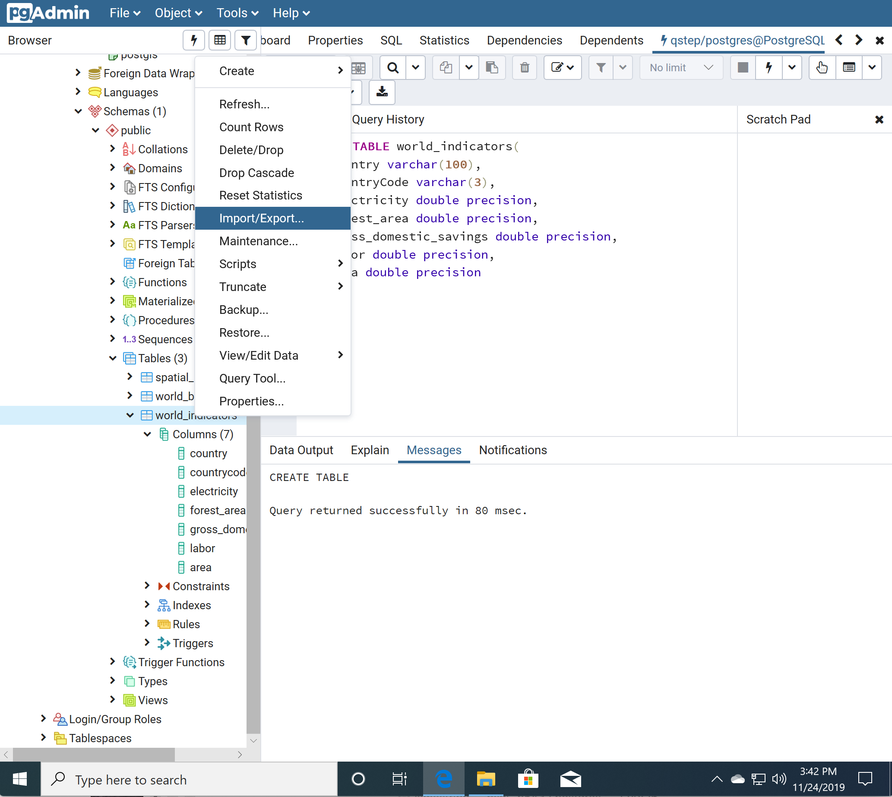

2. Click the import switch, select the correct file using the '...'  button, select ',' as the delimiter and click on the header switch.

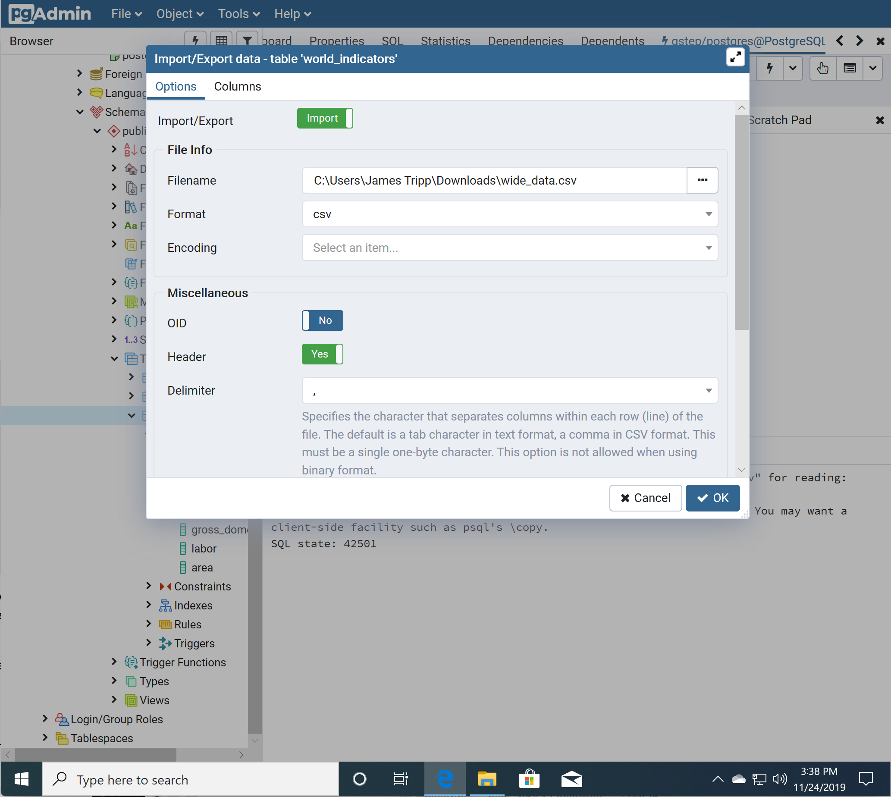

3. Click on the Columns tab and enter NA as the value for NULL.

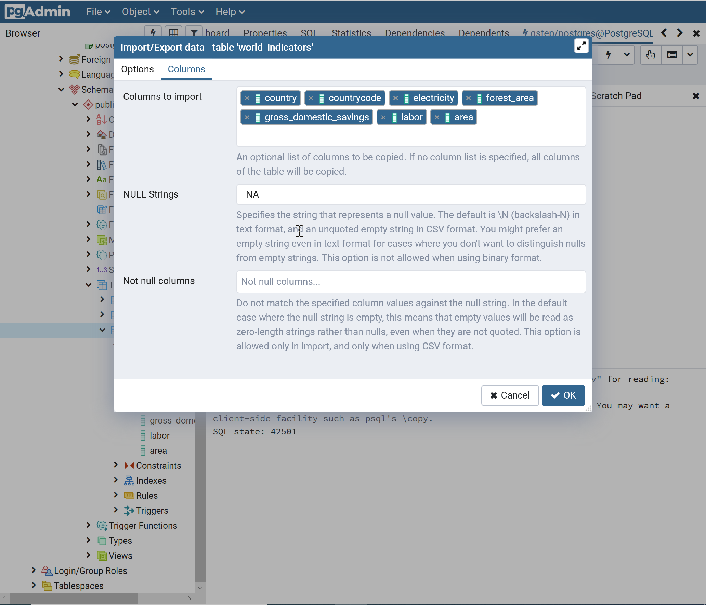

After clicking on then the data will be imported from the CSV to your world_indicators table.

To check that there is data in your table run the following.

```sql
SELECT * FROM world_indicators LIMIT 1;
```

Which should print out the first line of the world_indicators data.

```sql
qstep=# SELECT * FROM world_indicators LIMIT 1;
   country   | countrycode | electricity | forest_area | gross_domestic_savings |  labor  |  area  
-------------+-------------+-------------+-------------+------------------------+---------+--------
 Afghanistan | AFG         |          23 | 2.067824648 |           -33.76417609 | 8607338 | 652860
(1 row)

```

## World borders

PostGIS has a special tool called shp2pgsql for copying shape files into a database. The instructions for using the tool vary by operating system.

### MacOS

Following [here](https://postgresapp.com/documentation/cli-tools.html) change your terminal path

```sh
sudo mkdir -p /etc/paths.d &&
echo /Applications/Postgres.app/Contents/Versions/latest/bin | sudo tee /etc/paths.d/postgresapp
```

Enter your password when prompted. You won't be able to see what you're typing. Press enter once your password is entered. You will see the following if it is successful.

```sh
/Applications/Postgres.app/Contents/Versions/latest/bin
```

Open a new terminal and type in shp2pgsql followed by enter. You should see help text for the tool which looks like the below.

```sh
jamestripp@Jamess-iMac ~ % shp2pgsql 
RELEASE: 3.0.0 (r17983)
USAGE: shp2pgsql [<options>] <shapefile> [[<schema>.]<table>]
OPTIONS:
  -s [<from>:]<srid> Set the SRID field. Defaults to 0.
      Optionally reprojects from given SRID.
...
```

To load in your shape file type in

```sh
shp2pgsql your_file_path world_borders | /Applications/Postgres.app/Contents/Versions/12/bin/psql -p5432 "qstep"
```
where your_file_path is the location of the .shp file in the TM_WORLD_BORDERS folder. This line opens the shape file, converts the contents into data ready for PostgreSQL to read in and then pipes that data into PostgreSQL.

You can check the data is loaded in by running the following at the psql command prompt.

```sql
SELECT * FROM world_borders LIMIT 1;
```
The response will be

```sh
 gid | fips | iso2 | iso3 | un | name                | area | pop2005 | region | subregion |   lon   |  lat   |  geom |
   1 | AC   | AG   | ATG  | 28 | Antigua and Barbuda |   44 |   83039 |     19 |        29 | -61.783 | 17.078 |  ...  |
```

For printability I've inserted ... into the geom column as it will be a collection of random looking hexdecimal chracters which are a representation of the geometry.

### Windows 10

If you have followed the instructions above (using Stack Builder) then a tool called PostGIS shapefile and DBF loader will be install. This tool has a user interface. If you open the tool then you will see

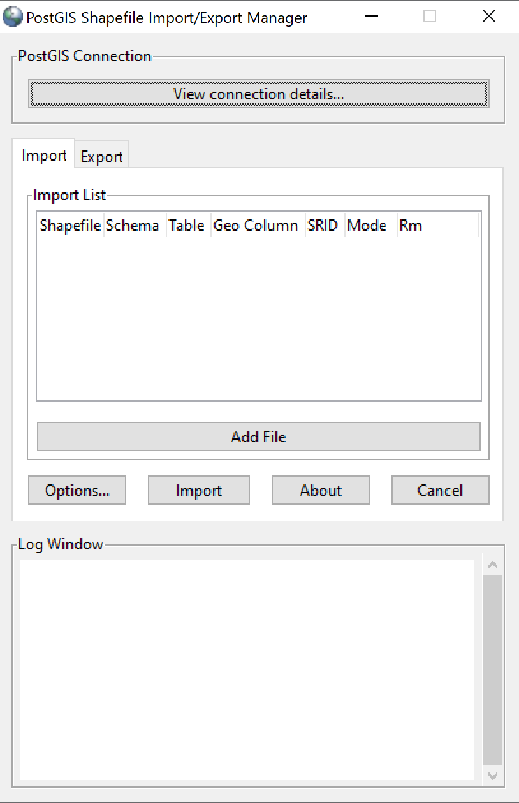

click on connection details and enter the postgres username, password and also specify the qstep database.

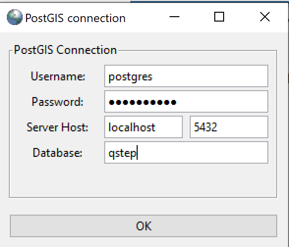

When you click ok and the low window should show you

```
Connecting:  host=localhost port=5432 user=postgres password='**********' dbname=qstep client_encoding=UTF8
Connection succeeded.
```

Click add file and choose the .shp file for TM_Borders. To keep things tidy, double click on table name and enter world_borders. This tells the tools that the table you create in PostgreSQL will be called world_borders. The tool interface should look something like.

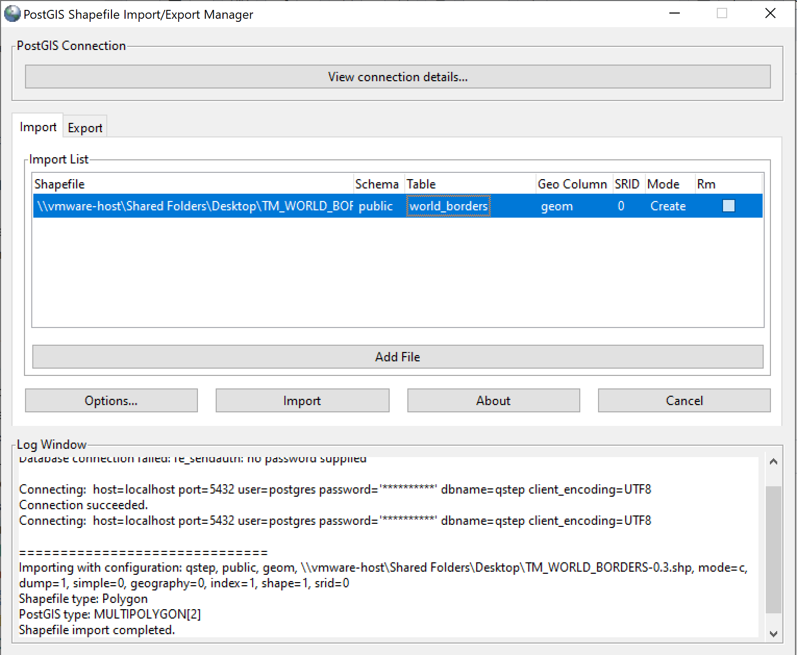

Finally, click import. The log window should show.

```
Importing with configuration: world_borders, public, geom, \\vmware-host\Shared Folders\Desktop\TM_WORLD_BORDERS-0.3.shp, mode=c, dump=1, simple=0, geography=0, index=1, shape=1, srid=0
Shapefile type: Polygon
PostGIS type: MULTIPOLYGON[2]
Shapefile import completed.
```

To check that the tool has imported the data run the query 

```sql
SELECT * FROM world_borders LIMIT 1;
```
and the query tool will show you the below.

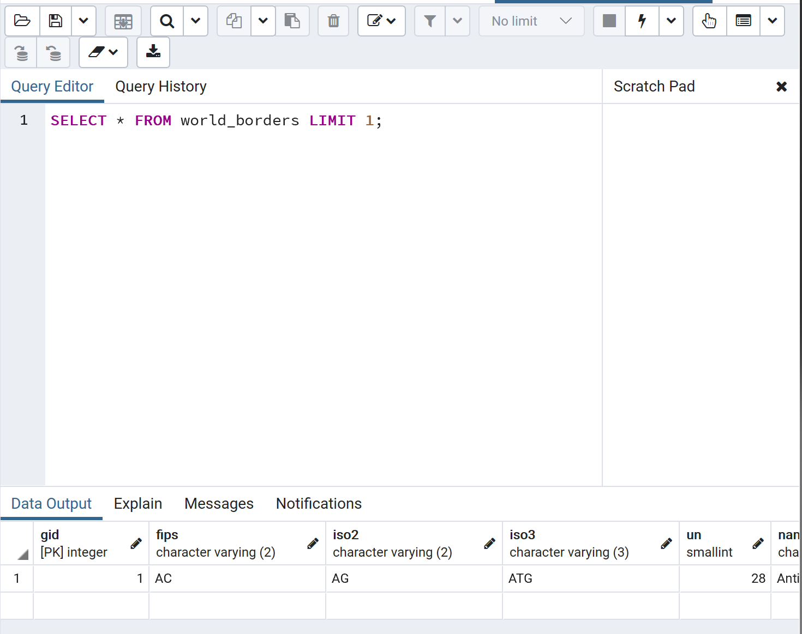

## SQL Dump

One can export the data from the database. To do, once your data is in the PostreSQL database, run

```sh
pg_dump -O qstep > qstep.sql
```

The .sql file created is a plain text set of instructions to PostgreSQL. The instructions contain the table definitions and the raw data. In the datasets folder is a file called qstep.sql which contains a dump of the tables created above.

To import the back in simply create a data base and run

```sh
psql database_name < qstep.sql
```

then psql will run the SQL commands in the .sql file to recreate the tables. More information about backing up and restoring in postgresql can be found [here](https://www.postgresql.org/docs/8.1/backup.html#BACKUP-DUMP-RESTORE).