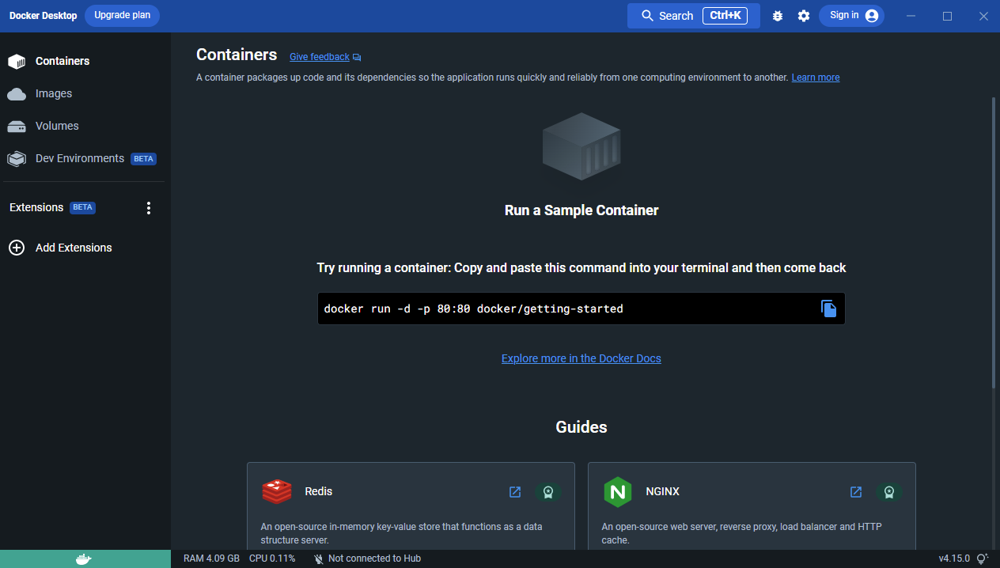
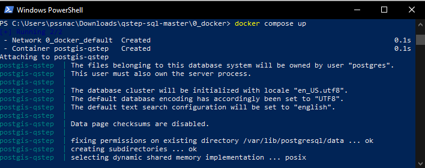
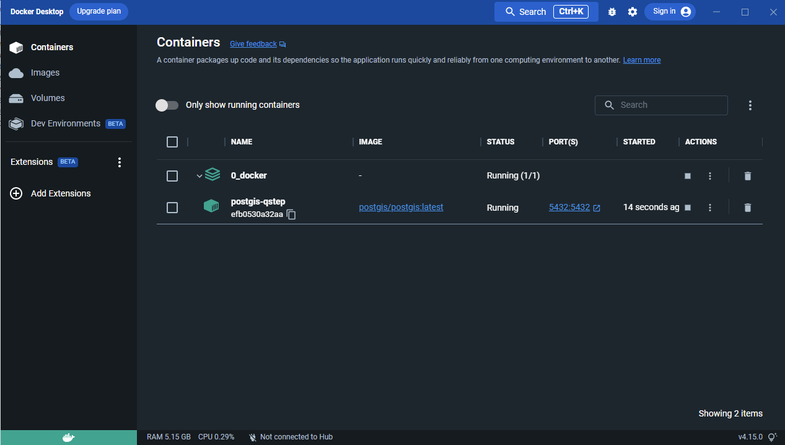
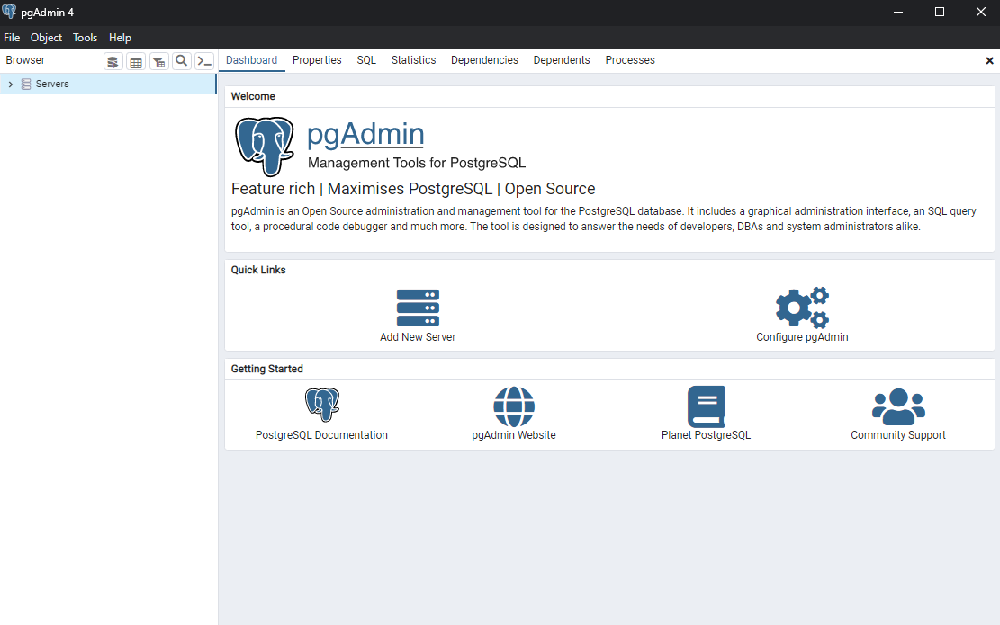
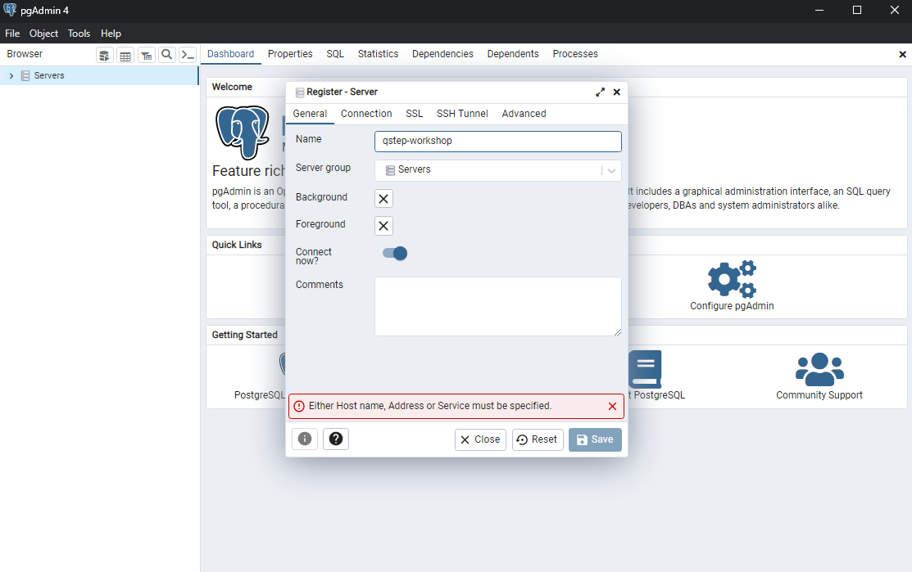
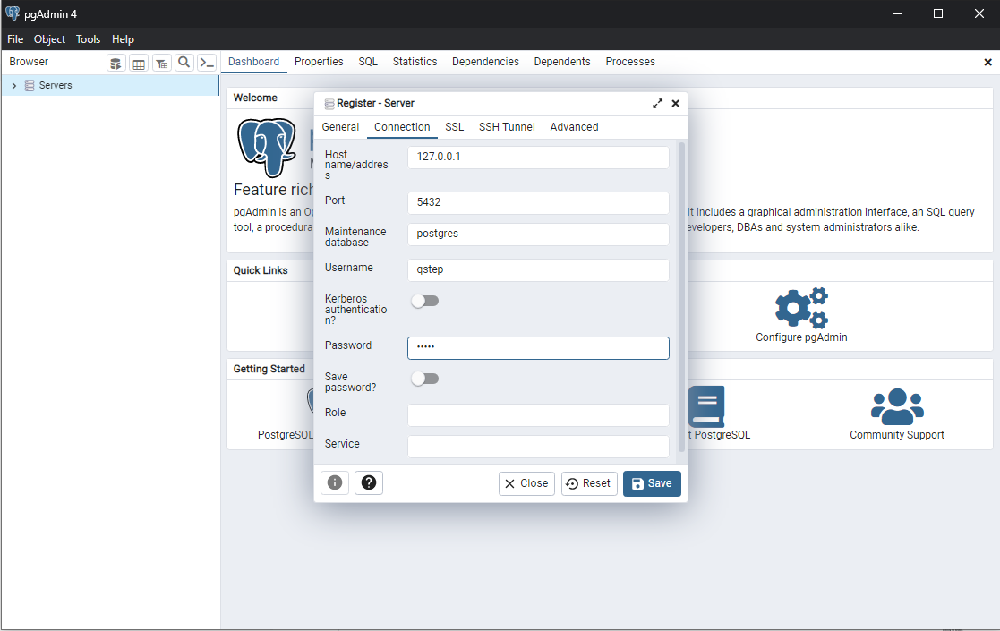
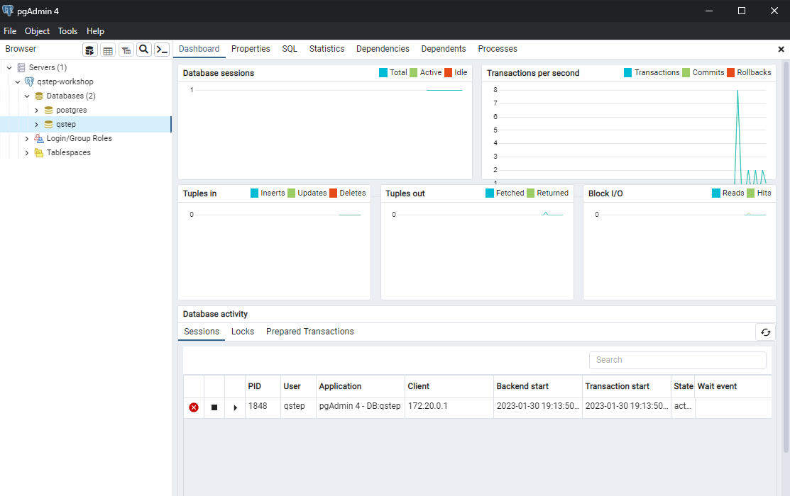
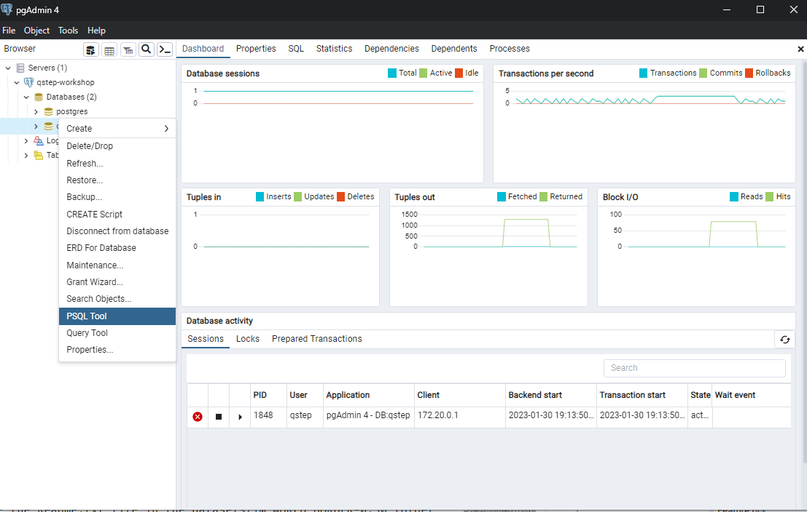
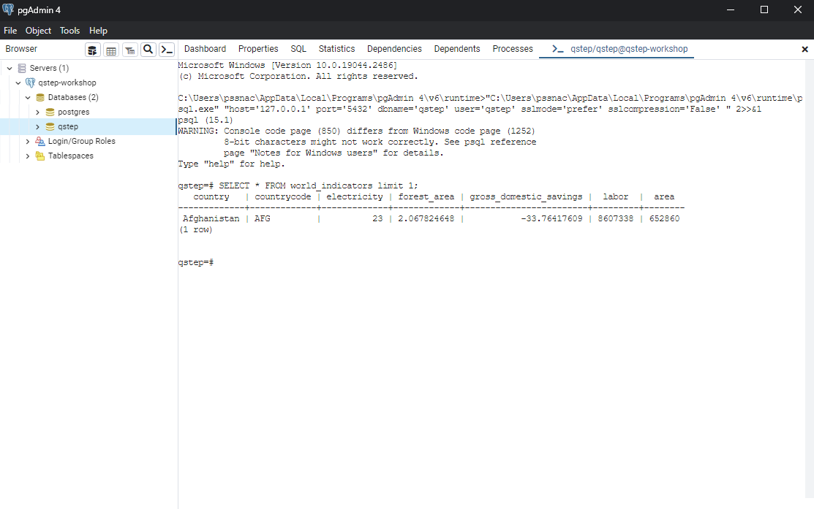
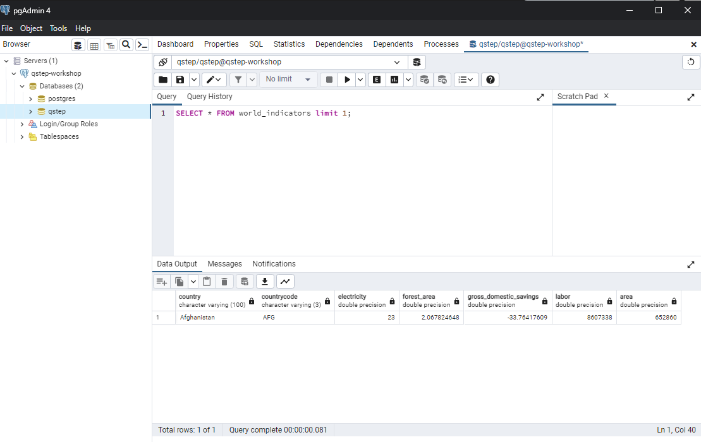

# Preparation

To prepare for the Workshop you should:

1. Install Docker
2. Download the database image and run the docker compose file
3. Install pgAdmin to interact with the database
4. Configure R to connect to the database

Steps 1 to 3 cover the requirements for most of the workshop. You may wish to do these in advance if you have a slow internet connection.

Deails for each step are below. Also, there are details of the datasets we use in this workshop at the bottom of this page. Below the data are installation instructions you can try if you cannot get Docker working, though these are much more complex and are to be considered out of date.

## Install Docker

If you using a recent version of Windows (10/11) or MacOS (Big Sur or newer) then install Docker Desktop ([MacOS](https://docs.docker.com/desktop/install/mac-install/), [Windows](https://docs.docker.com/desktop/install/windows-install/)). On a Linux OS you can install the Docker engine using the instructions [here]https://docs.docker.com/engine/install/).

You will need a computer with the minimum docker requirements and additional resources for the database, pgAdmin and (optionally) RStudio.

After installing Docker Desktop, should see the Docker Desktop application. Once you open the application it will appear something like the below.



The square in the bottom left will be green after a while. Docker needs to startup. Please wait until that square is green before continuing.

## Download database image and start the database

Docker uses premade images. An image contains all the file and processes you need to run an application. For our purposes, we will be using the PostGIS image. In that image is our database, Postgres, and the additions needed for working with geospatial data.

You can download the image via the desktop user interface or the command line.

### Download the image

#### From Docker Desktop

Within the Docker Desktop interface you can search for postgis and you can see the PostGIS images by clicking images in the search menu. Select the postgis/postgis image and click Pull.

You can see the image is downloaded via the images section of the user interface. It should look something like the below.

#### From the terminal

You can also download the image by running the below in a terminal or powershell windows.

```bash
docker pull postgis/postgis
```

The terminal window will show several lines of text. One it is complete then you can check the image has been downloaded by running the below.

```bash
docker image list
```

The postgis image should appear in the list of images.

### Start the database

Before you do this, download the files from this repository. You can do so by clicking [here](https://github.com/jamestripp/qstep-sql/archive/refs/heads/master.zip). Extract the files from the archive into a folder.

In the 0_docker folder there are two important files: workshop_data.sql and docker-compose.yml. The .sql file contains the data for our workshop. We want the database to load in this data so we can explore SQL. The docker-compose.yml file contains instructions which tells docker to start our database, import the data and make sure we can access the database using either pgAdmin or RStudio.

Unfortunately, Docker Desktop does not provide a user interface option for this. Instead, we need to use the terminal. Do the following:

1. Open up a terminal or powershell prompt. Type in cd followed by a space and then drag the 0_docker folder onto the terminal window. You should now see cd followed by the location of the 0_docker folder in full (see below).


2. Press enter. You have now changed the directory the terminal is in. To view the files in the directory type in ls and press enter. You should see two files docker-compose.yml and workshop_data.sql (like the below).


3. Type in docker compose up and press enter. You should see a bunch of text like the below. Congratulations, your database is now running :) The docker program is running a copy of the image, which is called a container, with the workshop data available. 



**Note** Please keep the terminal window open! If you close the windows then the container may stop. If the container does stop then follow steps 1-3 again.

4. You can also see that your container is running via the Docker Desktop application. Click on the containers option in Docker Desktop. You should see the container with a green icon next to it which indicates it is running.



You may also notice that there is a port column showing the numbers 5432:5432. We will connect to our database from pgAdmin or RStudio vai port 5432.

## Install pgAdmin and connect to the database

Our database is ready, the data is loaded in the database, and we can connect to the database via something called port 5432. We now need a program to speak to the database. PgAdmin is a program designed for that very activity.

### Installing pgAdmin

Go to the [pgAdmin download page](https://www.pgadmin.org/download/). Your installation instructions will differ slightly depending on your operating system.

For Windows, go to the [windows installer page](https://www.pgadmin.org/download/pgadmin-4-windows/) and install v6.19 by downloading and launching [this file](https://ftp.postgresql.org/pub/pgadmin/pgadmin4/v6.19/windows/pgadmin4-6.19-x64.exe).

For MacOS, go to the [MacOS installer page](https://www.pgadmin.org/download/pgadmin-4-macos/) and download v6.19 by download [this file](https://ftp.postgresql.org/pub/pgadmin/pgadmin4/v6.19/macos/pgadmin4-6.19.dmg) and, after opening the file, drag pgAdmin into your applications folder.

After you have installed pgAdmin, you should be able to click on the pgAdmin application in the start menu (windows) or double click in the Application folder (MacOS) to start. On start, you should see a window like the below.



You are now ready to connect to the database.

### Connecting to the database

1. Click on Add New Server and a window will appear. The Register - Server window will appear. Enter whatever Name you prefer, this will be the name displayed in pgAdmin.



2. Click on Connection. Here you add the connection details for our server. Enter the Hostname as 127.0.0.1, with the username qstep and password qstep. The port is preset as 5432 which is correct. Click on Save and pgAdmin, if pgAdmin reports no errors, then pgAdmin can connect to your database. Huzzah!



3. You should now see a server with whichever name you entered in the register server screen (the screenshot shows qstep-workshop because I entered that in the Name field). Clicking on the > arrow next to the name will show the databases Postgres is running. Our data is stored in qstep.



### Running queries

How do we ask our database questions? pgAdmin offers us two easy options: psql and the query tool. We access each by right clicking on the database we want (here it is qstep) and then selecting either psql or the query tool from the menu.



#### PSQL Tool

PSQL is a command line front end for interacting with a Postgres database. From the psql prompt you can run SQL queries and also PSQL specific commands.



#### Query Tool

The Query Tool is a prettier and has lots of useful functionality (such as query history and syntax highlighting). You can run queries much like PSQL.



**Congratulations!!** You now have a database running which contains the workshop data and you have the means to interact with the database. You are ready to start having fun with the database, starting with [2_SQwhat](../2_SQwhat/).