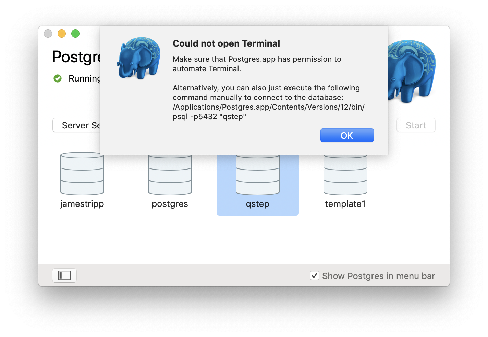
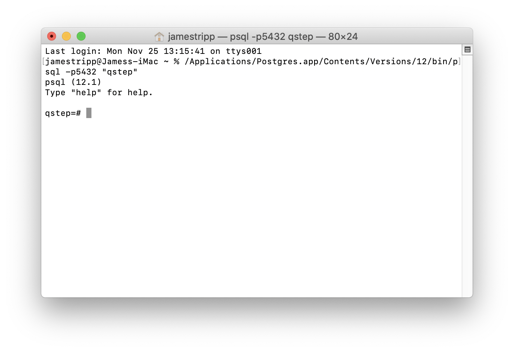
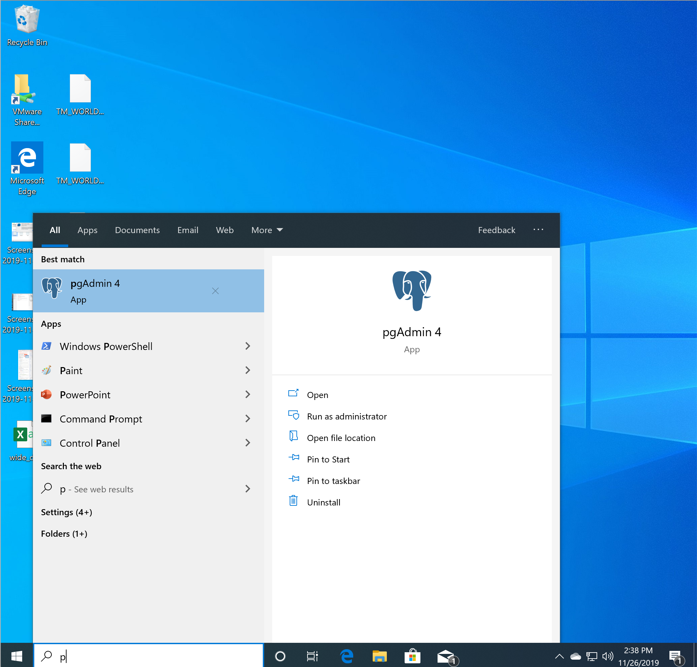
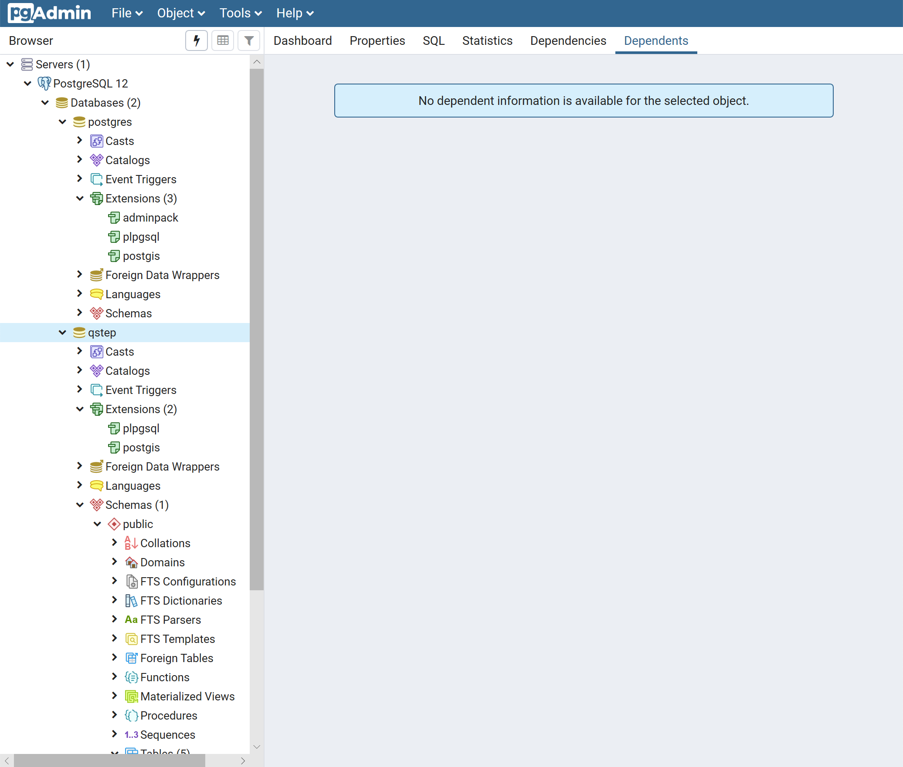
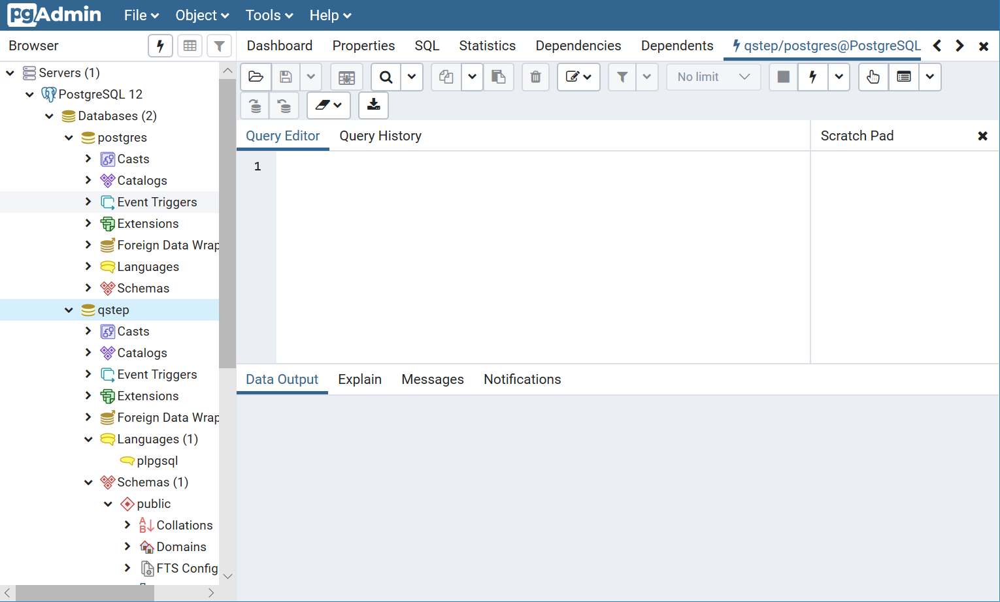
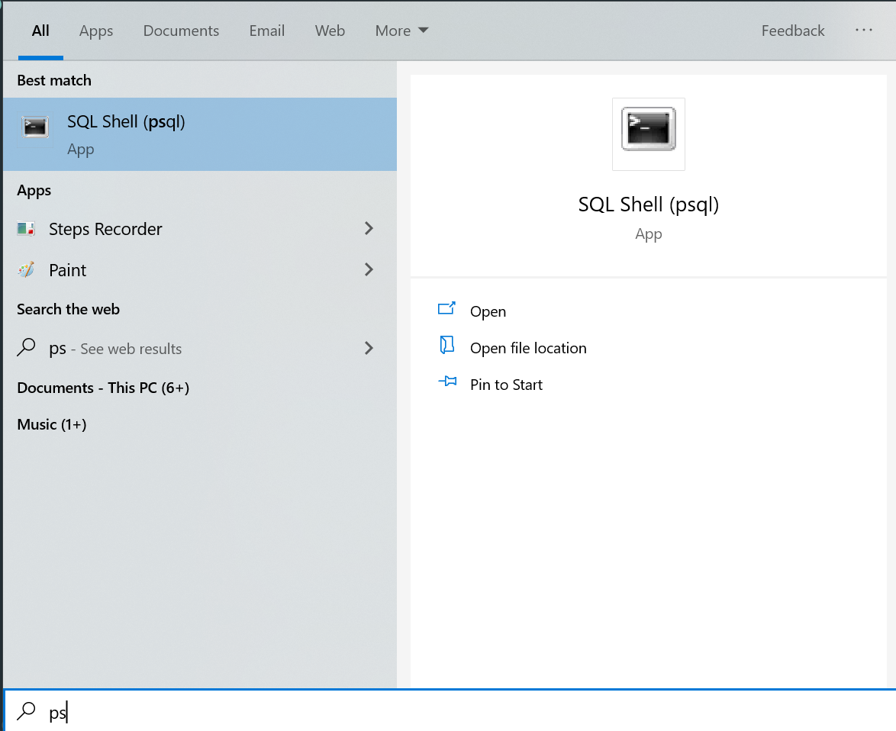
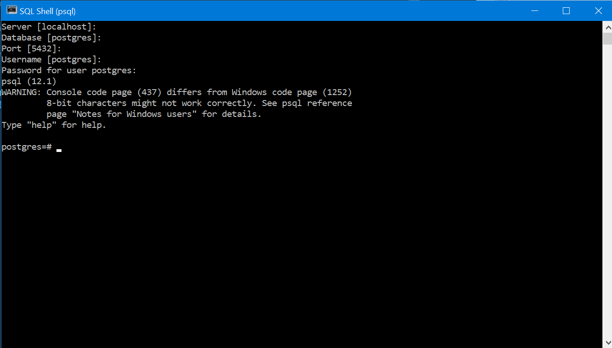

# SQwhat?

You will:

* Connect to a PostgreSQL database
* Query the database using the [SELECT](https://www.w3schools.com/sql/sql_select.asp), [WHERE](https://www.w3schools.com/sql/sql_where.asp), [FROM](https://www.w3schools.com/sql/sql_ref_from.asp), [LIMIT](https://www.w3schools.com/sql/sql_top.asp) and [ORDER BY](https://www.w3schools.com/sql/sql_orderby.asp) keywords
* Manage tables using the [CREATE TABLE](https://www.w3schools.com/sql/sql_create_table.asp), [DROP TABLE](https://www.w3schools.com/sql/sql_drop_table.asp) and AS TABLE keywords

## Connecting to PostgreSQL

### You have created a local instance

If you have followed the instructions in 1_preparation then postgreSQL will be running on your computer. The way you issue SQL commands will depend on the operating system you are using.

#### MacOS

Open the postgres.app program. Make sure it is running (the circle is green) and double click on the qstep database. Either a terminal will be open, ready for you to type in SQL commands, or you will get a message like the below.



If the message is displayed then go to Applications > Utilities > Terminal. In the terminal copy the command (like the below) and press enter.

```sh
/Applications/Postgres.app/Contents/Versions/12/bin/psql -p5432 "qstep"
```

You will then see the terminal window display a prompt like the below. You are ready to type in your SQL commands.



#### Windows 10

The program pgAdmin will allow you to issue queries. Click on start and select pgAdmin.



Then pgAdmin will start in your web browser. Enter your pgAdmin master password, click on PostgreSQL 12 and enter the password for the postgres user that you selected when installing PostgreSQL.

You should now be able to see the databases, including qstep.



Click on the qstep database (as shown above). From the top menu select Tools > Query Tool. The Query Tool will open and you can enter SQL commands into the Query Editor and click on the lightening bolt button to run the SQL comand.



##### psql on windows 10

You can also run psql by pressing the windows key and searching for psql. 



You will need to press enter a few times until you need to type in the postgres password you chose during install. Values in [ ] indicate default values. So when you are shown username[postgres]: this indicates your username will be set to postgres if you press enter.

You will eventually be shown the psql interface. From this command prompt you can type in SQL commands.



### You will connect to the CIM server

QSTEP masterclass students are able to connect to a database hosted on a CIM server. If you attend the QSTEP masterclass then James will provide your username, password and the location of the server.

This guide is publically available so I will refer to the server as servername.warwick.ac.uk, the user as qstepuser and the password as thispassword. Please insert the values from the link above when doing this in the masterclass.

Open the terminal. On MacOS go to Applications > Utilities > Terminal. On Windows 10 open command line or powershell. Type in the following and press enter.

```sh
ssh qstepuser@servername.warwick.ac.uk
```

You will then be prompted to enter the password. When you type nothing will be shown, this is fine, and then press enter. You should then be logged into the server and see something like the below in the terminal.

```sh
psql (12.5 (Ubuntu 12.5-0ubuntu0.20.04.1))
Type "help" for help.

postgres=#
```

You can now type in SQL commands, press enter and they will run on the server.

## Querying

### psql

There are a few commands which are specific to the psql program. These are useful to know.

| Command     | What it does                                 |
|-------------|----------------------------------------------|
| \c database | Connects you to database                     |
| \l          | Show the databases in PostgreSQL             |
| \dt         | Describes the tables in the current database |
| \du         | Describes the users                          |

These and a few others commands are details [here](http://www.postgresqltutorial.com/psql-commands/).

These commands are not SQL but part of the psql program.

### SQL

You are now ready to type in some SQL and get data from our database.

#### SELECT

To return all the data in the area column of the world_indicators table

```sql
SELECT area FROM world_indicators;
```

which will return 265 values from our dataset. If you are using psql then you can press q to return to the psql command prompt.

As you can see the command takes the following format.

```sql
SELECT column_name FROM table_name;
```

**Note**: You need to include a ';' at the end of your SQL statement.

To select multiple columns we add a comma between column names.

```sql
SELECT column_name1, column_name2 FROM table_name;
```

#### LIMIT

We may not want all the data. Instead, we specify a limit on the number of data points returned.

```sql
SELECT area FROM world_indicators LIMIT 5;
```

Will return the first 5 values of the area column in world_indicators table.

#### *

If you want to select all of the columns in a table

```sql
SELECT * FROM world_indicators;
```

which will give you lots of data. SQL will do what you command, even if the command is not very sensible.

Instead, you could run

```sql
SELECT * FROM world_indicators LIMIT 5;
```

for the first few entries of all the columns and - this is a nice trick - you could just get the column names

```sql
SELECT * FROM world_indicators LIMIT 0;
```

which gives you

```sql
qstep=#  SELECT * FROM world_indicators LIMIT 0;
 country | countrycode | electricity | forest_area | gross_domestic_savings | labor | area
---------+-------------+-------------+-------------+------------------------+-------+------
(0 rows)

```

neat, huh?

#### Your turn

The best way to learn how to use SQL is, well, to use SQL. Try and do the below tasks.

1. Connect to the qstep database
2. List the tables in the qstep database
3. Show the first 5 values in the country, forest_area and labor_force columns

Raise your hand if you have issues connecting to or using the database.

#### WHERE

One way to filter our data is using WHERE to specify logical requirements for the results.

What do you think the following will do?

```sql
SELECT country FROM world_indicators WHERE area > 20000000;
```

The structure of this type of query is

```sql
SELECT column_name FROM table_name WHERE test;
```

where test is a logical test. The comparison operators for postgreSQL are detailed [here](https://www.postgresql.org/docs/9.1/functions-comparison.html).

You can include logical operators too (see the logical operators documentation [here](https://www.postgresql.org/docs/9.1/functions-logical.html)).

 What do you think this will do?

```sql
SELECT country FROM world_indicators WHERE area < 10000000 AND labor > 100;
```

The structure here is

```sql
SELECT column_name FROM table_name WHERE test1 AND test2;
```

and we put this on seperate lines to make it more readable. PostgreSQL cares only about where the statement starts and where you indicate the end of it with a ';'. So this is fine

```sql
SELECT column_name
FROM table_name
WHERE test1 AND test2;
```

and we can show only the first 5 results as follows.

```sql
SELECT column_name
FROM table_name
WHERE test1 AND test2
LIMIT 5;
```

As an aside, we can select the data for a single country

```sql
SELECT * FROM world_indicators WHERE country = 'United Kingdom';
```

#### Your Turn

1. What are the first 15 countries in the table?
2. Which countries have a labor_force score of above 800000?
3. Which countries have a labor_force score of above 800000 and a land_area greater than 10000000.
4. Are there any issues with our dataset? Are there any strange entries?

#### ORDER, ORDER!

The order of the above output is by table order. The first entry in the table comes out first. That is not idea.

What if we want to order the countries by labor, electricity or another column?

Hmmm. What do you think the below does?

```sql
SELECT country, labor 
FROM world_indicators 
ORDER BY labor ASC
LIMIT 5;
```

What about this one?

```sql
SELECT country, labor 
FROM world_indicators
ORDER BY labor DESC
LIMIT 50;
```

Is there anything unusual about the output of the above? Why does the below give you better results?

```sql
SELECT country, labor 
FROM world_indicators
WHERE labor IS NOT NULL 
ORDER BY labor DESC
LIMIT 50;
```

#### Your Turn

1. Which 5 countries have the least % of population with access electricity? Can you find the top 5 countries with the most access to electricity? 
2. How much labor force do the 10 countries with the least electicity have?
3. Order the countries by gross domestic savings. What do you notice?

## Creation

Creating a table requires a table name, the column names and stating the data type in the column.

```sql
CREATE TABLE people
(
    fullname varchar(50),
    age int
);
```

The above creates a new table called people with the fullname and age columns. Entries in fullname must be characters and entries into age must be whole numbers (integers). Character columns should have the max length of characters specified.

A full breakdown of all the different data types is [available here](https://www.postgresql.org/docs/9.5/datatype.html) and a warmer introduction to data types is [here](http://www.postgresqltutorial.com/postgresql-data-types/).

We can check our table exists.

```sql
qstep=# \dt
              List of relations
 Schema |       Name       | Type  |  Owner   
--------+------------------+-------+----------
 public | people           | table | qstep
 public | qstep            | table | postgres
 public | spatial_ref_sys  | table | postgres
 public | world_borders    | table | postgres
 public | world_indicators | table | postgres
(5 rows)
```

The above table is like any other. We can query the contents easily.

```sql
qstep=# SELECT * FROM people;
 fullname | age
----------+-----
(0 rows)
```

Our table is empty.

What if we made a mistake and want to destroy the table? Well, there's a DROP keyword for this. **Note** Deleted tables are gone, there's no recyle bin here.

```sql
DROP TABLE people;
```

Scary stuff.

Let us recreate our table

```sql
CREATE TABLE people
(
    fullname varchar(50),
    age int
);
```

and insert some data into it

```sql
INSERT INTO people (fullname, age)
VALUES ('James Tripp', 36);
```

and check it looks sane.

```sql
qstep=# SELECT * FROM people;
  fullname   | age
-------------+-----
 James Tripp |  36
(1 row)
```

As an aside, we can import data into a table from csv

```sql
COPY people (firstname, age) 
FROM 'C:\tmp\people.csv' DELIMITER ',' CSV HEADER;
```

if we have a file called people.csv which contained two columns called firstname and age. In [1_preperation](../1_preparation) we import the csv file containing our world indicators into our local world_indicators table.

Finally, we can create copies of tables. To create a copy of our world_indicators table called my_world_indicators

```sql
CREATE TABLE my_world_indicators AS
TABLE world_indicators;
```

Or save the output of a query into a new table.

```sql
CREATE TABLE country_labor AS 
SELECT country, labor
FROM world_indicators;
```

Which creates a new table called country_labor containing the columns country and labor from the world_indicators table. We can check, just to make sure.

```sql
qstep=# SELECT * FROM country_labor LIMIT 2;
   country   |  labor  
-------------+---------
 Afghanistan | 8607338
 Albania     | 1281634
(2 rows)
```

A nice article detailing copying tables is available [here](http://www.postgresqltutorial.com/postgresql-copy-table/).

Well done, you're almost at the end of the first practical segment!

#### Your Turn

1. Create a table called your name (for me, it would be called james) which contains columns for your age and height.
2. Add rows to this table with guesses of your height at the ages of 5, 10 and 15. 
3. Create a copy of the world_indicators table called yourname_world_indicators (for me, it would be james_world_indicators) containing information for countries with a labor force above 8,000,000.
